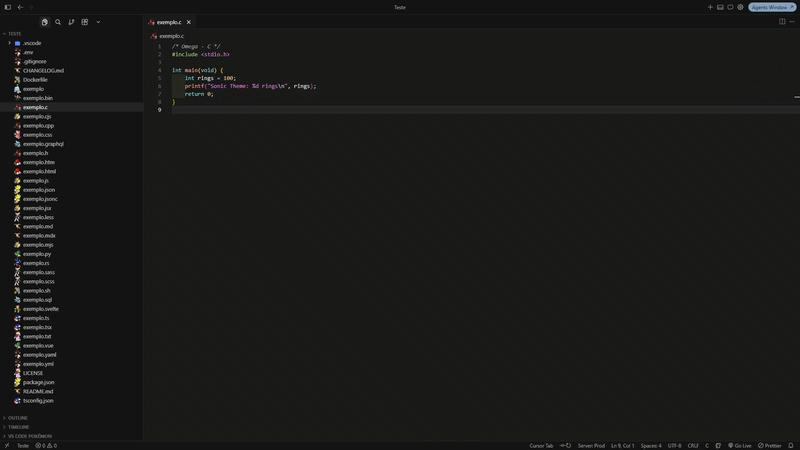

# Sonic Inspired Theme

Unofficial fan theme pack for Visual Studio Code / Cursor - **six color themes** (Sonic, Tails, Knuckles × Dark/Light) plus character file icons. Free, non-profit, **not affiliated with SEGA**.

> *Gotta go fast* - ship code like you're tearing through Green Hill Zone.

<p align="center">
  
</p>

*Sonic Team Update* - Blue blur, two-tailed genius, and the guardian of Angel Island, right in your editor. Welcome to the next act.

## Themes (`Ctrl+Shift+P` / `Cmd+Shift+P`)

Type **Sonic-Inspired**:

| Command | Applies |
|---------|---------|
| **Choose Theme…** | Quick pick of all six themes |
| **Sonic Dark** / **Sonic Light** | Sonic color theme |
| **Tails Dark** / **Tails Light** | Tails color theme |
| **Knuckles Dark** / **Knuckles Light** | Knuckles color theme |

You can also use `Ctrl+K Ctrl+T` for colors and **Preferences: File Icon Theme** → **Sonic-Inspired Icons**.

You're too slow if you're still picking themes by hand every morning - use **Choose Theme…** and keep rolling.

## Color themes

| Theme | Description |
|-------|-------------|
| **Sonic-Inspired Dark** | Navy background, blue accents, gold highlights |
| **Sonic-Inspired Light** | Pale-blue background, same semantic palette |
| **Sonic-Inspired Tails Dark** | Deep yellow `#2A2400`, accent `#F1AF00`, blue `#1C98D1` |
| **Sonic-Inspired Tails Light** | White / `#F5F5F5`, yellow `#F1AF00`, blue `#1C98D1` |
| **Sonic-Inspired Knuckles Dark** | Deep red `#1A0608`, chrome `#D01212`, olive `#9AA85E` |
| **Sonic-Inspired Knuckles Light** | Peach `#FFE0C9`, red `#B90C14`, olive `#6F7A3A` |

Tails and Knuckles themes keep a clear primary/secondary accent pair and use **bold** on errors so status is not color-only (friendlier for color vision deficiency).

Chaos Emerald tip: pair a color theme with **Sonic-Inspired Icons** for the full Adventure-era vibes.

## File icons

26 character icons mapped by color/vibe (Tails→JS, Sonic→TS, Knuckles→HTML, Super→JSON, Metal→Rust, Chaos→SQL, …).

No Badniks in the explorer - just the gang from Station Square to Radical Highway.

## Install

### Marketplace

1. Extensions → search **Sonic Inspired Theme**
2. Install → `Ctrl+Shift+P` → **Sonic-Inspired: Choose Theme…**

https://marketplace.visualstudio.com/items?itemName=AndreLuizJPoles.sonicinspired-theme

### Local development

```bash
npm install
npm run package
```

Press **F5**, or install `sonicinspired-theme-1.2.0.vsix`.

## License

Dual - see [LICENSE](LICENSE): MIT for code/themes; non-commercial restriction for character PNGs.

## Links

- Marketplace: https://marketplace.visualstudio.com/items?itemName=AndreLuizJPoles.sonicinspired-theme
- Repository: https://github.com/AndreLuizJPoles/SonicTheme
